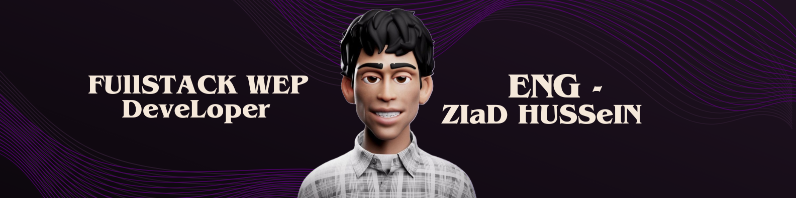

## Hi there 👋

<!--
**ziadhusseinx/ziadhusseinx** is a ✨ _special_ ✨ repository because its `README.md` (this file) appears on your GitHub profile.

Here are some ideas to get you started:

- 🔭 I’m currently working on ...
- 🌱 I’m currently learning ...
- 👯 I’m looking to collaborate on ...
- 🤔 I’m looking for help with ...
- 💬 Ask me about ...
- 📫 How to reach me: ...
- 😄 Pronouns: ...
- ⚡ Fun fact: ...
-->

<h1 align="center">Hi 👋, I'm Ziad</h1>

<h3 align="center">A passionate fullstack developer</h3>

- 👨‍💻 All of my projects are available at [ziad.great-site.net](ziad.great-site.net)

- 💬 Ask me about **python , js and c++**

- 📫 How to reach me **husseinziad709@gmail.com**

- 📄 Know about my experiences [https://github.com/ziadhusseinx](https://github.com/ziadhusseinx)

- ⚡ Fun fact **i love my work**

<h3 align="left">Connect with me:</h3>

# 💻 Tech Stack:
                               

<h3 align="left">Support:</h3>

  

